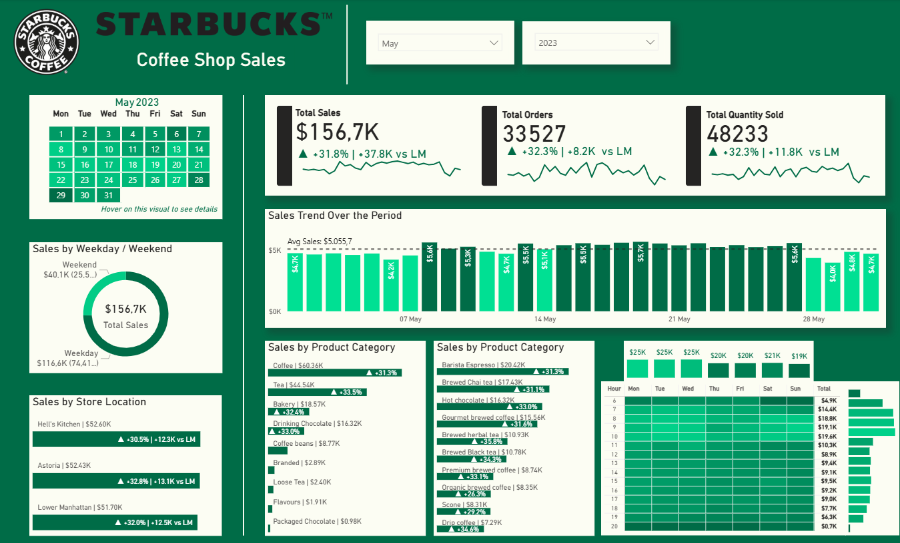
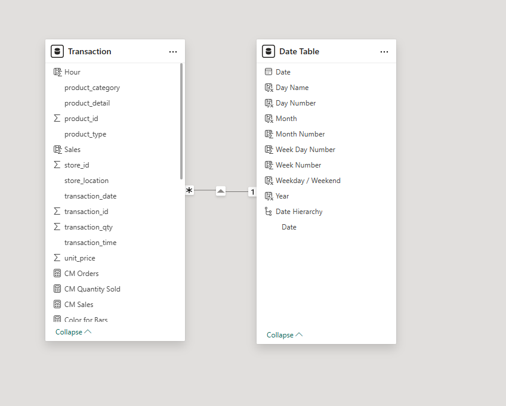

# Coffee Shop Sales - Power BI Dashboard
An interactive Power BI dashboard tracking daily sales, orders, and quantity sold across a coffee shop chain (Starbucks-themed), broken down by store location, product category, weekday/weekend, and hour of day.



## Overview
This dashboard provides a comprehensive view of coffee shop performance for a selected month and year, including sales trends over time, product category breakdowns, store location comparisons, and an hour-by-weekday heatmap of sales activity. It is built entirely in Power BI with a custom data model and DAX calculations.

**Example Period - May 2023**

| Metric | Value | vs Last Month |
|---|---|---|
| Total Sales | $156.7K | +31.8% (+$37.8K) |
| Total Orders | 33,527 | +32.3% (+8.2K) |
| Total Quantity Sold | 48,233 | +32.3% (+11.8K) |

## Data Model
The report uses a simple star-schema data model with **two tables**:

```
┌───────────────┐                 ┌───────────────┐
│  Transaction  │ *─────────────1 │  Date Table   │
└───────────────┘                 └───────────────┘
```


### Tables
**Transaction** - Main fact table containing raw sales transactions and all DAX measures.
- `Hour`, `product_category`, `product_detail`, `product_id`, `product_type`
- `store_id`, `store_location`, `transaction_date`, `transaction_id`, `transaction_qty`
- `transaction_time`, `unit_price`

**Date Table** - Standard date dimension.
- `Date`, `Day Name`, `Day Number`, `Month`, `Month Number`
- `Week Day Number`, `Week Number`, `Weekday / Weekend`, `Year`, `Date Hierarchy`

### Key DAX Measures
| Measure | Description |
|---|---|
| `Sales` | Total sales value |
| `CM Sales` / `CM Orders` / `CM Quantity Sold` | Current month sales, orders, and quantity sold |
| `PM Sales` / `PM Orders` / `PM Quantity Sold` | Previous month sales, orders, and quantity sold |
| `MoM Growth & Diff Sales` | Month-over-month absolute & percentage change in sales |
| `MoM Growth & Diff Orders` | Month-over-month absolute & percentage change in orders |
| `MoM Growth & Diff Quantity Sold` | Month-over-month absolute & percentage change in quantity sold |
| `Month Growth Sales Color` / `Orders Color` / `Quantity Sold Color` | Conditional formatting colors based on MoM growth direction |
| `Total Sales` / `Total Orders` / `Total Quantity Sold` | Grand totals for the selected period |
| `Daily Avg Sales` | Average daily sales used as the reference line in the trend chart |
| `Color for Bars` | Dynamic bar coloring logic |
| `Label for Product Category` / `Label for Product Type` / `Label for Store Location` | Dynamic axis/label controls |
| `New MoM Label` | Formatted label combining growth % and absolute change (e.g. "+31.8% \| +37.8K vs LM") |
| `TT For Hour` | Tooltip measure powering the hour-by-weekday matrix |
| `Map Note` / `Placeholder` | Supporting measures for visual formatting |

## Visuals
### 1. KPI Header Cards
Displays Total Sales, Total Orders, and Total Quantity Sold for the selected month/year, each with a month-over-month absolute and percentage change indicator and a sparkline trend.

### 2. Calendar Heatmap
A custom calendar grid for the selected month, shaded by daily sales intensity. Hovering over a day reveals a tooltip with that day's total sales, orders, quantity sold, and a sales/orders/quantity breakdown donut chart.

### 3. Sales by Weekday / Weekend
A donut chart comparing total sales generated on weekdays versus weekends.

### 4. Sales by Store Location
A horizontal bar chart comparing total sales across store locations (Hell's Kitchen, Astoria, Lower Manhattan), each with a month-over-month change indicator.

### 5. Sales Trend Over the Period
A daily bar chart showing sales for each day of the selected month against a dotted average sales reference line.

### 6. Sales by Product Category
Two ranked bar charts breaking down sales by product category (Coffee, Tea, Bakery, Drinking Chocolate, etc.) and by product type (Barista Espresso, Brewed Chai Tea, Hot Chocolate, Gourmet Brewed Coffee, etc.), each with a percentage growth indicator.

### 7. Hour × Weekday Sales Matrix
A heatmap matrix showing total sales by hour of day (rows) and day of week (columns), with a row-level total sales bar chart and column totals summarized at the top. Hovering over a cell shows a tooltip with the day, hour, and sales/orders/quantity breakdown.

## Technologies Used
* **Data Visualization:** Power BI
* **Data Modeling:** Power BI Data Model (Star Schema)
* **Calculations:** DAX (Data Analysis Expressions)
* **Data Cleaning & Transformation:** Power Query
---
Disclaimer: This project is a portfolio piece. The data utilized is synthetic/mock data created for demonstration purposes.
